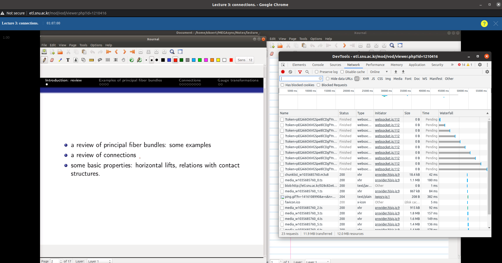

<Collapsable title='How to download your lecture uploaded on eTL' titleSize='1.6rem'>

<!-- # How to download your lecture uploaded on __eTL__ -->

> Current method (Focused on Chrome browser) is Not completed.

Log in to __eTL__ and open the lecture.

Press __F12__ to open a DevTools window.



Click _Network_ tab on the top of the window, and Play your video.

then in the below,

One can notice that rows whose name is of form _media_blahblah_0.ts_ are generated. Click it.


Then find __Request URL__ on your right.

The value of it is a link for downloading __10s__ clip of the video.

So the strategy is:

0. Find one of links for downloading a 10s clip.
1. Donwload all the clips.
2. Concat them into one video file.

## 1. Download all the clips

Use any of your favorite languaes, make a script to download all the clips when you give them any one of URL found above.

Example:

```python:title=eTLdownloader.py
from urllib import request
from optparse import OptionParser

save_dir = '/media/cats/catsdata/Data/Lectures/video-20-2'

# How to concat videos
# ffmpeg -f concat -i input.txt -codec copy output.mp4
# where input.txt is form of 
#   file 'input_0.ts'
#   file 'input_1.ts' 
#   ...

parser = OptionParser()
parser.add_option("-u", "--url",
    dest = 'url', help='one example url able to download a part of the lecture.'
)
# url = 'http://etlstream.snu.ac.kr:1935/ctlocw/_definst_/mp4:df33b4dc-b257-45b9-a013-299ace828b4c/2020/09/08/50ace279-cf02-4a40-904d-659d7d5228bc/089dc4ff-82cd-4401-98ef-3cb7fe7ac1c5.mp4/media_w706336764_3.ts'
parser.add_option("-n", "--name",
    dest = 'fn', help='file name to be downloaded'
)

options, args = parser.parse_args()

url = options.url
fn = options.fn

url_head = '_'.join(url.split('_')[:-1])
print(url)
print(fn)
idx = 0
with open(save_dir + '/input.txt', 'w') as f:
    while True:
        try:
            url_full = url_head + '_' + str(idx) + '.ts'
            fn_path = save_dir + '/' + fn + '_' + str(idx) + '.ts'
            
            print(url_full, ">>", fn_path)
            request.urlretrieve(url_full, fn_path)
            f.write("file " + fn_path + '\n')
            idx += 1
        except:
            break

print("Job's done")

```

## 2. Concat them into one file

> TODO: Find any method to concat them

```bash
ffmpeg -f concat -safe 0 -i input.txt -codec copy output.mp4
```

</Collapsable>

<Collapsable title='Sheaf' titleSize='1.6rem'>

<!-- # Sheaf -->

_Continued from 09/08_

## Adapted Class (Right-exact)
Given an abelian category $\mathcal{A}$ and a right-exact functor $\mathcal{F}$ from $\mathcal{A}$, 

a class of objects $\mathcal{R} \subset \mathcal{A}$ is adapted to $\mathcal{F}$ if it satisfies the followings:

> * stable under finite direct sums
> * $\mathcal{F}$ acts like exact in $\text{Kom}^-(\mathcal{R})$
> * any object from $\mathcal{A}$ is a __quotient__ of an object from $\mathcal{R}$

If $\mathcal{A}$ contains sufficiently many projective objects, then the class of all injective objects is an adapted to any left-exact functor from $\mathcal{A}$


## Kernel/Cokernel Sheaf

__Proposition 1.5.4.__

Let $\mathcal{K},\mathcal{C}$ be a kernel, cokernel of a morphism between sheaves, $f: \mathcal{F} \to \mathcal{G}$.

Then, $\mathcal{K}$ becomes a sheaf, but $\mathcal{C}$ is not always a sheaf but a presheaf.

___pf)___

* Kernel of a morphism between sheaves becomes a sheaf

Let $U=\cup U_i$ and $s_i \in \mathcal{K(U_i)}$. There is an unique $s \in \mathcal{F}$ satisfying

$$
res_{U, U_i}(s) = s_i
$$ 

as $\mathcal{K}(U_i) \subset \mathcal{F}(U_i)$. 

To check that $s \in \mathcal{U}$, one need to show that $f(u)=0 \in \mathcal{G}$.

Since $^\forall i,\ s_i \in \mathcal{K}(U_i)$, $res_{U, U_i}(f(s)) = f(s_i) = 0$. 

And there is an unique section $t \in \mathcal{G}(U)$ such that 

$$
res_{U, U_i}(t) = f(s_i) = 0
$$

So, $f(s) = t$ is a zero section in $G(U)$, therefore, $s \in \mathcal{K}(U)$.

* Cokernel of a morphism between sheves becomes a presheaf, but not always becomes a sheaf.

[GM] introduces a counter example.

Considering $Y=\mathbb{C} \setminus 0$ with its structure sheaf $\mathcal{O}_Y$ as a sheaf of holomorphic functions on $Y$.

for any point $y \in Y$, choose a neighborhood $N_y$. 

If $N_y$ contains $0$ then $\rm{dim}( \rm{coker}(f(N_y)) )=1$ but $0$ otherwise.

It means that glued section may not be unique in some large neighborhood containing $0$, so $\rm{coker}$ is a presheaf but not always sheaf.

## Global section functor is left-exact

__Proposition__ 

Let $0 \rightarrow \mathscr{A} \rightarrow \mathscr{B} \rightarrow \mathscr{C} \rightarrow 0$ is an exact sequence of abelian sheaves on $X$.

Then, $^\forall U$, open subset of $X$,

$$
0 \to \mathscr{A}(U) \to \mathscr{B}(U) \to \mathscr{C}(U) 
$$
is an __exact__ sequence of abelian groups.

___pf)___


</Collapsable>

<Collapsable title='Algebraic Geometry' titleSize='1.6rem'>
 
> 3rd lecture

## Projective Variety

Variety generated by constant functions

* $V(0)= \mathbb{P}^n$, $V(1)=\emptyset$

Variety generated by homogeneous polynomials of degree 1

* polynomials generated subspace $k^{l+1} \simeq W \subset V \simeq k^{n+1}$, $\mathbb{P}^l \simeq \mathbb{P}W \subseteq \mathbb{P}^n$

We call $\mathbb{P}W$ as _projective line_, _projective plane_, _projective hyperplane_, _projective $k$-plane_ when $k=1, 2, n-1, k$.

Check the following properties:

* $\mathbb{P}W \cap \mathbb{P}W' = \mathbb{P}(W \cap W')$

* $\mathbb{P}W \cup \mathbb{P}W' \subset \mathbb{P}(W \cup W')$

* (Exercise) Let $\Lambda = \mathbb{P}W$ be given, then $W$ is unique.

* (Exercise) Let $\Lambda = \mathbb{P}W, \Lambda' = \mathbb{P}W'$ where $W \simeq k^{k+1}, W' \simeq k^{l+1}$,

    then $\rm{dim}$ $(\Lambda \cap \Lambda') = k+l-n$, _Check codimensions of them_

* elt $\in \mathbb{P}V^\vee$ corresponds to a hyperplane $\subset \mathbb{P}V$

* More generally, $k$-plane in $\mathbb{P}^\vee$ corresponds to a $n-k-1$ plane in $\mathbb{P}V$

    Since $k$-plane in $\mathbb{P}^\vee$ is defined by $k+1$ polynomials, corresponding element in $\mathbb{P}V$ can be defined by zeros of them.

Variety consists of finite points

* Defining polynomials have not necessarily same dimension, 

    __e.g.__ $V({x}) = V({xy, x(y-z), x(z+y)})$

* If $\Gamma$ is a finite variety with $d$ points not lying on the same line, then it can be represented by $d$ homogeneous polynomials. 

    Strategy: Consider an ideal generated by $(\prod h_i)$s where $h_i$ is a hyperplane contains $i$th points but not any others.

* In the above statement, One can reduce $d$ to $d-1$ by considering a hyperplane contains $i$th points and $j$th points but not any others and hyperplanes contains $k$th points but not any others and $k \neq i,j$.

* The condition is called ___general___. __i.e.__ objects are in some open set in _Zariski_ topology.

__Thm__

$\Gamma \subset \mathbb{P}^n$ consists of $d$'s different points 

then there is an ideal $\mathfrak{A}$ such that $V(\mathfrak{A})=\Gamma$ and every homogeneous polynomials in $\mathfrak{A}$ is of degree 2 whenever $|\Gamma| = d \leq 2n$.

___pf)___

> vector space consists of 2 dimensional homogeneous has dimension $\frac{(n+1)(n+2)}{2} > 2n \geq d$. 
> It implies that there is a system of linear equations on the space has solutions containing $\Gamma$ exist.
> ... Continue!

</Collapsable>

 