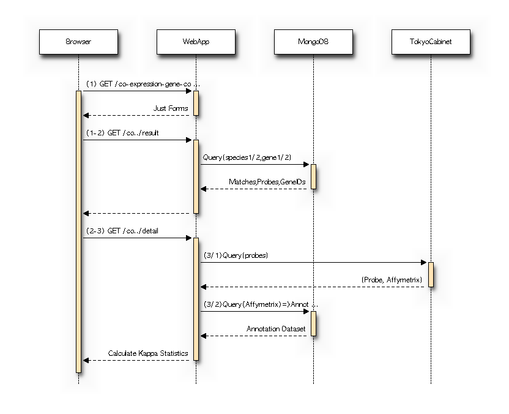

# CS

## Sequence Diagram

You can use _seqdiag_ uploaded in PyPI. Note that it is a CLI tool.

ref: [PyPI](https://pypi.org/project/seqdiag/), [GIT](https://github.com/blockdiag/seqdiag/), [DOCS](http://blockdiag.com/en/seqdiag/index.html)

[_Example_](https://jeen.tistory.com/entry/python-seqdiag-Sequence-Diagram-%EC%8B%A4%EC%A0%9C-%EC%82%AC%EC%9A%A9%EA%B8%B0)

```text
{
  Browser  -> WebApp [label = "(1) GET /co...-compare"]
  Browser <-- WebApp [label = "Just Forms"]

  Browser  => WebApp [label = "(1-2) GET /co../result"] {
              WebApp -> MongoDB [label = "Query[s../../2]"]
              WebApp <-- MongoDB [label = "Matches,Probes,GeneIDs"]
  }

  Browser  -> WebApp [label = "(2-3) GET /co../detail"]
              WebApp ->  TokyoCabinet [label = "(3/1)Query[probes]"]
              WebApp <-- TokyoCabinet [label = "[Probe, Affymetrix]"]
              WebApp ->  MongoDB [label = "(3/2)Query(Affymetrix)=>Annotation"]
              WebApp <-- MongoDB [label = "Annotation Dataset"]
  Browser <-- WebApp [label = "Calculate Kappa Statistics"]
}
```


# Reidemeister

_Revisit to Ch.0_

"We will study the twisted cohomological groups given by $\rho: \pi_1(M) \to SL_2(K)$" for some function field of some variety over algebraic closed field $k=\bar{k}$. 

__Notations__

* $\mathscr{O}_v \subset K$: a __valuation subring__ of $K$ with $k$, their residual field at point $v$.(?)

* $\text{Ad}: \text{SL}_2(K) \to \text{Aut}(\mathfrak{sl}_2(K))$: The adjoint representation induced by conjugation. 
It is equal to $g \mapsto dR_{g^{-1}}^*(\cdot)$. where $R_g$ is a right translation on the lie group.

* $H^*(M, \text{Ad}\circ\rho)$: The twisted cohomology groups with an action of $\pi_1(M)$ on $\mathfrak{sl}_2(K)$ through $\text{Ad}\circ\rho$.

* $H^*(M, \rho)$: The twisted cohomology groups with an action of $\pi_1(M)$ on $\text{SL}_2(K)$ through $\rho$.

Sometimes, $\rho:\pi_1(M) \to \text{SL}_2(\mathscr{O}_v)$ is given, then

* $H^*(M, \text{Ad}\circ\rho)_v$: the twisted cohomology(?) group with coefficients in $\mathfrak{sl}_2(\mathscr{O}_v)$.

* $H^*(M, \rho)_v$: the twisted cohomology(?) group with coefficients in $\mathscr{O}^2_v$.(?)

* $\bar{\rho}: \pi_1(M)(\to \text{SL}_2(\mathscr{O}_v) \to) \text{SL}_2(k)$ is induced by $\mathscr{O}_v \to k$, __the residual map__.

* $H^*(M, \text{Ad}\circ\bar{\rho})$ is the twisted group for the action of $\pi_1(M)$ on $\mathfrak{sl}_2(k)$.

* $H^*(M, \bar{\rho})$ is the twisted group for the action of $\pi_1(M)$ on $k^2$.

* $H^*(M, \lambda)$ for $\lambda: \pi_1(M) \to k^*$, multiplication on the field $k$, is the twisted cohomology groups with action of $\lambda$.

$=H^*(M, k)$ for the case $\lambda = 1$.

---

The torsion of the twisted cohomology complex induced by $\rho: \pi_1(M) \to \text{SL}_2(\mathbb{C})$ for $M$: a hyperblic 3-manifold has been studied for a long time.

1. The adjoint torsion by ___Joan Porti___
2. The standard torsion and the relation with the twisted __Alexander polynomial__ by ___Teruaki Kitano___.

## The Reidemeister Adjoint Torsion

It is a topological invariant defined as $\text{tor}(M, \text{Ad}\circ\rho)$. It is interpreted as a volume element in the twisted cohomology. __i.e.__ an element in
$$
\text{Det}(H^*(M, \text{Ad}\circ\rho)) = \otimes^3 \text{Det}(H^i(M, \text{Ad}\circ\rho))^{(-1)^i}
$$
Moreover, two twisted cohomology is naturally isomorphic whenever given two representation are in a cojugation relation. __i.e.__ It does not depend on the choice of a representation $\rho$.

Hence, It is defined naturally as a section of some line bundle over _character variety_.

The torsion can be interpreted as an analytic function on the Zariski open subset of character variety depending on a choice of a boundary curve [Por97]

and it was been extended to the whole character variety by _J.Dubois_ and _S.Garoufalidis_ [DG16].

Also, it can be interpreted as a rational volume form on the character variety via _Marche_'s work,

precisely, if $\partial M = S^1 \times S^1$, then the torsion is a rational volume form on the _augmented character variety_, $\bar{X}(M)$,
$$
\bar{X}(M) = \{(\rho, \lambda: \pi_1(\partial M) \to \mathbb{C}^*) \text{Tr}\rho|\pi_1(M) = \lambda + \lambda^{-1} \} // \text{SL}_2(\mathbb{C}) 
$$
which is $2$-fold covering of the character variety $X$.

From now, $X(M) = X(\pi_1(M))$ will be assumed $1$-dimensional and reduced as a scheme.

To achive first condition, $M$ will be assumed as small, __i.e.__ $M$ is without closed incompressible oriented surface not parallel to $\partial M$.

And $\underline{X}$ be the irreducible component of $\bar{X}(M)$ containing the character of an irreducible representation, 

$Y$ be a smooth projective model(smooth compact curve obtained from $\underline{X}$ by desingularizing and adding a finite number of points at infinity, ideal points of $Y$.)

element of $Y$, $v$, can be viewed as a valuation on $\mathbb{C}(Y) = \mathbb{C}(\underline{X})$, 

its local ring will be denoted by $\mathscr{O}_v$, torsion will be denoted by $\text{tor}(M, \text{Ad}\circ\rho)$ as an element in $\Omega_{\mathbb{C}(Y)/\mathbb{C}}$.

---

__Theorems__ (will be continued)
1. Vanising properties of the torsion
2. Boundness of vanising of the torsion related to the Culler-Shalen theory

# Foundations on the Differential Geometry

Yet to write down..