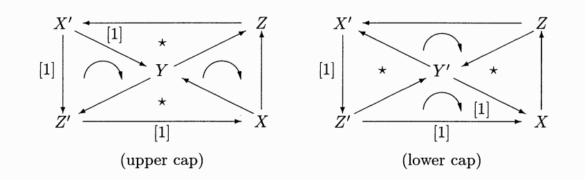

# Knot

* 읽는 것과 쓰는 것에 대한 준비 (Read to write)

*  What to write:

1. Calculations, especially about invariants of the character variety of knots etc.

2. Analysis on S-code(A-code)

# Homological Algebra

* brim: 모자의 챙, 컵사발 등의 위 끝부분

## Triangulated Categories

It is a kind of generalization of _distinguished trainges_ defined in the Ch.3 in [GM]

Let us recall the definitions about them.

__Def__ A __trangle__ in a complex of some cotegory is a diagram of the form
$$
K^\bullet \xrightarrow{u} L^\bullet \xrightarrow{v} M^\bullet \xrightarrow{w} K[1]^\bullet
$$

A __morphism__ between traingles is a commutative diagram of the form
$$
\begin{matrix}
K^\bullet & \xrightarrow{u} & L^\bullet & \xrightarrow{v} & M^\bullet & \xrightarrow{w} & K[1]^\bullet \\
\downarrow  f & & \downarrow g & & \downarrow h & & \downarrow f[1] \\
K_1^\bullet & \xrightarrow{u_1} & L_1^\bullet & \xrightarrow{v_1} & M_1^\bullet & \xrightarrow{w_1} & K_1[1]^\bullet \\
\end{matrix}
$$
A morphism is said to be an isomorphism if all the vertical maps are isomorphisms in the category.

A triangle is said to be __distinguished__ if it is isomorphic to
$$
\begin{matrix}
K^\bullet & \xrightarrow{\bar{f}} & \text{Cyl}(f) & \xrightarrow{\pi} & C(f) & \xrightarrow{\delta} & K[1]^\bullet \\
& & \parallel & & \parallel & & \\
& & K^\bullet \oplus K[1]^\bullet \oplus L^\bullet & & K[1]^\bullet \oplus L^\bullet & & 
\end{matrix}
$$
where differential maps defined in $\text{Cyl}(f)$ and $C(f)$ are the followings:
$$
d_{\text{Cyl}(f)}(k^i, k^i+1, l^i) = (d_K k^i - k^{i+1}, -d_K k^{i+1}, f(k^{i+1}) + d_L l^i)
$$
$$
d_{C(f)}(k^i+1, l^i) = (-d_K k^{i+1}, f(k^{i+1}) + d_L l^i)
$$

For an additive category $\mathcal{D}$, one can define a structure of _triangulated category_ on $\mathcal{D}$.

__Def__ A structure of __triangulated category__ on $\mathcal{D}$ consists of _data_ and _axioms_, \text{TR}1 \tilde \text{TR}4.

* the _translation functor_ $T$ which is an additive(preserving biproducts diagram) automorphism on $\mathcal{D}$. 

Easily, $T$ is an translation functor by only $1$.

* the _triangles_
$$
X \xrightarrow{u} Y \xrightarrow{v} Z \xrightarrow{w} X[1] = T(X)
$$

* the morphisms of triangles 
$$
\begin{matrix}
X & \xrightarrow{u} & Y & \xrightarrow{v} & Z & \xrightarrow{w} & X[1] \\
\downarrow  f & & \downarrow g & & \downarrow h & & \downarrow f[1] \\
X; & \xrightarrow{u_1} & Y' & \xrightarrow{v_1} & Z' & \xrightarrow{w_1} & X'[1] \\
\end{matrix}
$$

* the _distinguished triangles_
Triangles which satisfy axioms.

__TR1__

* $X \xrightarrow{\text{id}} X \to 0 \to X[1]$ is a distinguished triangle.

* Any triangle isormophic to a distinguished one is distinguished.

* Any morphism $X \xrightarrow{u} Y$ can be completed to a distinguished triangle $X \xrightarrow{u} Y \xrightarrow{v} Z \xrightarrow{z} X[1]$

__TR2__

A triangle $X \xrightarrow{u} Y \xrightarrow{v} Z \xrightarrow{z} X[1]$ is distinguished if and only if the triangle $Y \xrightarrow{v} Z \xrightarrow{w} X[1] \xrightarrow{-u[1]} Y[1]$ is distinguished.

Note1: there is a minus sign on $u[1]$.

Note2: It is directly derived that $Z[-1] \xrightarrow{-w[-1]} X \xrightarrow{u} Y \xrightarrow{v} Z$ is also distinguished.

__TR3__

In the diagram of a morphism of triangles without $h$,

$h$ is derived from $f$ and $g$ and so the diagram can be completed. $h$ doesn't need to be unique.

__TR4__

Any diagram of the type "upper cap" can be completed to an octahedron diagram.

the followings are _upper cap_ diagram and _lower cap_ diagram from [GM].

with coincidence of the morphisms $Y \to Z \to Y'$ and $Y \to Z' \to Y'$, and $Y' \to X[1] \to Y[1]$ and $Y' \to X' \to Y[1]$. $\star$ indicates a distinguished triangle.

